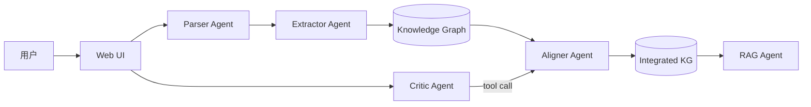

# AI_DEV_SPEC.md
> 本文档是 AI 编程工具的**唯一执行依据**。所有技术选型、目录结构、接口契约、实现细节均已锁定，**禁止擅自更改**。如遇冲突，以本文档为准；如本文档未规定，优先选择"最简单能跑"的方案，并在 `docs/decisions.md` 记录。

---

## 0. 项目身份

- **项目名**：`textbook-integrator`（学科知识整合智能体）
- **比赛**：第一届浙大 AI 全栈极速黑客松
- **开发时长**：5 小时（已开始倒计时）
- **交付物**：
  1. 一个可访问的 Vercel 部署 URL
  2. GitHub 仓库（公开）
  3. `docs/Agent架构说明.md`
  4. README.md（含演示账号、示例数据、操作指引）

- **评分核心**：**完成度 > 创新性 > 复杂度**。所有 P0 必须**至少能跑通 demo 流程**，不要追求完美。

---

## 1. 锁定的技术栈（禁止替换）

| 模块 | 选型 | 备注 |
|---|---|---|
| 框架 | **Next.js 14 App Router** + TypeScript | `app/` 目录 |
| 样式 | **Tailwind CSS** + **shadcn/ui** | 不要写自定义 CSS |
| 图谱可视化 | **react-force-graph-2d** | 不要用 Cytoscape/D3 |
| PDF 解析 | **pdfjs-dist**（**前端**解析） | 绕开 Vercel 函数 10s 超时 |
| DOCX 解析 | **mammoth**（前端） | 可选 |
| MD/TXT | 原生 fetch + 正则 | |
| LLM | **火山引擎 Doubao**（OpenAI 兼容协议） | 用 `openai` SDK 改 baseURL |
| Embedding | **doubao-embedding-text-240715** 或最新可用版 | 单批 ≤256 条 |
| 向量存储 | **内存数组 + 余弦相似度**（`/tmp/vectors.json` 持久化） | 禁止上 pgvector/Pinecone |
| 状态管理 | **Zustand** + `localStorage` | |
| 后端持久化 | **`/tmp/*.json`** 文件 | 不要数据库 |
| 部署 | **Vercel** | Node Runtime, `maxDuration: 60` |

### 1.1 依赖清单（一次性安装）

```bash
pnpm add next@14 react react-dom typescript
pnpm add openai zustand
pnpm add react-force-graph-2d
pnpm add pdfjs-dist mammoth
pnpm add zod nanoid
pnpm add lucide-react clsx tailwind-merge
pnpm add -D @types/node @types/react @types/react-dom
pnpm add -D tailwindcss postcss autoprefixer
```

shadcn/ui 组件按需添加：
```bash
pnpm dlx shadcn@latest add button card input textarea dialog sheet tabs scroll-area badge progress toast
```

---

## 2. 环境变量（`.env.local`）

```env
# 火山引擎 Doubao（用户提供）
ARK_API_KEY=xxxxx
ARK_BASE_URL=https://ark.cn-beijing.volces.com/api/v3
ARK_CHAT_MODEL=doubao-1-5-pro-32k-250115
ARK_EMBED_MODEL=doubao-embedding-text-240715

# 整合参数
SIM_THRESHOLD=0.85
TARGET_COMPRESS_RATIO=0.30
```

> ⚠️ 在 Vercel 项目设置里手动添加同样的环境变量。**不要把 key 提交到 git**。

---

## 3. 目录结构（必须严格遵守）

```
textbook-integrator/
├── app/
│   ├── layout.tsx              # 三栏布局根
│   ├── page.tsx                # 主页（左教材/中图谱/右面板）
│   ├── globals.css
│   └── api/
│       ├── textbooks/route.ts      # POST 上传解析结果, GET 列表
│       ├── extract/route.ts        # POST 抽取知识点+关系
│       ├── align/route.ts          # POST 跨教材对齐整合
│       ├── rag/index/route.ts      # POST 建索引
│       ├── rag/query/route.ts      # POST 提问
│       └── chat/route.ts           # POST 多轮对话改决策
├── components/
│   ├── ui/                     # shadcn 组件
│   ├── TextbookPanel.tsx       # 左侧
│   ├── GraphView.tsx           # 中间（react-force-graph 封装）
│   ├── GraphCompare.tsx        # 整合前后对比
│   ├── RagPanel.tsx            # RAG 问答
│   ├── ChatPanel.tsx           # 多轮对话
│   ├── DecisionList.tsx        # 整合决策列表
│   └── CompressionStat.tsx     # 压缩比卡片
├── lib/
│   ├── doubao.ts               # LLM/embedding 封装
│   ├── parser/
│   │   ├── pdf.ts              # 前端 pdfjs
│   │   ├── md.ts
│   │   ├── txt.ts
│   │   └── docx.ts
│   ├── chunk.ts                # 分块算法
│   ├── extract.ts              # 知识点抽取 prompt
│   ├── align.ts                # 对齐+整合
│   ├── rag.ts                  # 余弦检索
│   ├── store.ts                # Zustand store
│   └── types.ts                # 全局类型
├── data/                       # 演示用示例教材（≥2 本，每本 1-2 章节即可）
│   ├── sample-1.md
│   └── sample-2.md
├── docs/
│   ├── Agent架构说明.md          # 必交文档
│   └── decisions.md             # AI 自行记录的决策日志
├── public/
├── .env.local
├── .env.example
├── next.config.js              # 含 maxDuration: 60
├── tailwind.config.ts
├── package.json
├── tsconfig.json
├── README.md
└── AI_DEV_SPEC.md              # 本文档
```

---

## 4. 核心数据模型（`lib/types.ts`）

```ts
export type TextbookId = string;

export interface Textbook {
  id: TextbookId;
  name: string;
  format: 'pdf' | 'md' | 'txt' | 'docx';
  size: number;
  status: 'parsing' | 'ready' | 'error';
  totalChars: number;
  chapters: Chapter[];
  uploadedAt: number;
}

export interface Chapter {
  id: string;
  title: string;
  index: number;
  pageStart?: number;
  pageEnd?: number;
  text: string;
  charCount: number;
}

export interface KnowledgePoint {
  id: string;
  name: string;
  definition: string;
  category: '概念' | '定理' | '方法' | '现象' | '其他';
  textbookId: TextbookId;
  chapterId: string;
  page?: number;
  frequency: number;          // 用于节点大小
  sourceSpans: { chunkId: string; text: string }[];
}

export interface Relation {
  id: string;
  source: string;             // KP id
  target: string;
  type: '前置依赖' | '并列' | '包含' | '应用';
  description: string;
}

export interface Chunk {
  id: string;
  textbookId: TextbookId;
  textbookName: string;
  chapterId: string;
  chapterTitle: string;
  page?: number;
  text: string;
  embedding?: number[];
}

export interface AlignDecision {
  id: string;
  groupKpIds: string[];       // 同义组
  decision: 'merge' | 'keep' | 'remove';
  reason: string;
  confidence: number;         // 0-1
  mergedName?: string;
  modifiedByUser?: boolean;
}

export interface ChatMessage {
  role: 'user' | 'assistant' | 'tool';
  content: string;
  toolCall?: { name: string; args: any; result?: any };
  ts: number;
}
```

---

## 5. API 契约（每个 route 的输入/输出锁死）

### 5.1 `POST /api/textbooks`
**入参**：完整 `Textbook` 对象（前端解析好）  
**出参**：`{ ok: true, id }`  
**副作用**：写入 `/tmp/textbooks.json`

### 5.2 `POST /api/extract`
**入参**：`{ textbookId }`  
**逻辑**：读取该教材所有章节，并发调用 LLM 抽取知识点+关系。**并发上限 5**。  
**出参**：`{ knowledgePoints: KnowledgePoint[], relations: Relation[] }`  
**副作用**：写入 `/tmp/kg-${textbookId}.json`

### 5.3 `POST /api/align`
**入参**：`{ textbookIds: string[] }`（≥2）  
**逻辑**：
1. 对所有 KP 的 `name + definition` 做 embedding
2. 两两余弦相似度 > `SIM_THRESHOLD` 的入候选
3. 候选组喂 LLM 二次判定（输出 merge/keep/remove + reason + confidence）
4. 计算压缩比

**出参**：
```json
{
  "decisions": [AlignDecision],
  "mergedKnowledgePoints": [KnowledgePoint],
  "mergedRelations": [Relation],
  "stats": {
    "originalChars": 123456,
    "integratedChars": 36000,
    "ratio": 0.29
  }
}
```
**副作用**：写入 `/tmp/aligned.json`

### 5.4 `POST /api/rag/index`
**入参**：`{ textbookIds: string[] }`  
**逻辑**：分块 → batchEmbed → 存 `/tmp/vectors.json`  
**出参**：`{ ok: true, chunkCount: 234 }`

### 5.5 `POST /api/rag/query`
**入参**：`{ question: string, topK?: 5 }`  
**逻辑**：embed 问题 → 余弦 top-k → 拼 prompt 调 chat  
**Prompt 模板（必须照抄）**：
```
你是严格的教材问答助手。仅基于下方【上下文】回答问题。
- 必须在回答中标注引用，格式：[《教材名》第X章 第X页]
- 引用必须来自给定上下文的 metadata，禁止编造
- 若上下文不足，回复："根据现有教材内容，无法回答该问题。"

【上下文】
{contexts}

【问题】
{question}
```
**出参**：
```json
{
  "answer": "...",
  "citations": [
    { "textbookName": "...", "chapter": "...", "page": 12, "snippet": "..." }
  ]
}
```

### 5.6 `POST /api/chat`
**入参**：`{ messages: ChatMessage[] }`  
**逻辑**：LLM + Function Calling，工具集：
- `update_decision(decisionId, newDecision, reason)`
- `split_merged(decisionId)`
- `merge_two(kpIdA, kpIdB)`
- `list_decisions()`

**出参**：流式或完整 `{ message: ChatMessage, updatedDecisions?: AlignDecision[] }`

---

## 6. 关键实现细节（AI 必读）

### 6.1 `lib/doubao.ts`（核心，先写）
```ts
import OpenAI from 'openai';

export const ark = new OpenAI({
  apiKey: process.env.ARK_API_KEY!,
  baseURL: process.env.ARK_BASE_URL,
});

export async function chat(messages: any[], opts: { json?: boolean; tools?: any[] } = {}) {
  const res = await ark.chat.completions.create({
    model: process.env.ARK_CHAT_MODEL!,
    messages,
    response_format: opts.json ? { type: 'json_object' } : undefined,
    tools: opts.tools,
    temperature: 0.3,
  });
  return res.choices[0].message;
}

export async function batchEmbed(texts: string[]): Promise<number[][]> {
  const BATCH = 64;
  const out: number[][] = [];
  for (let i = 0; i < texts.length; i += BATCH) {
    const slice = texts.slice(i, i + BATCH);
    const res = await ark.embeddings.create({
      model: process.env.ARK_EMBED_MODEL!,
      input: slice,
    });
    out.push(...res.data.map(d => d.embedding as number[]));
  }
  return out;
}

export function cosine(a: number[], b: number[]): number {
  let dot = 0, na = 0, nb = 0;
  for (let i = 0; i < a.length; i++) { dot += a[i]*b[i]; na += a[i]*a[i]; nb += b[i]*b[i]; }
  return dot / (Math.sqrt(na) * Math.sqrt(nb) + 1e-9);
}
```

### 6.2 分块（`lib/chunk.ts`）
- 窗口 **600 字**，重叠 **80 字**
- 优先按 `。！？\n\n` 切分
- 每个 chunk **必须**带 metadata：`{ textbookId, textbookName, chapterId, chapterTitle, page }`

### 6.3 知识点抽取 Prompt（`lib/extract.ts`）
```ts
const PROMPT = `
你是教材知识点抽取专家。从下方章节文本中抽取知识点和关系，严格输出 JSON。

要求：
1. 知识点：概念/定理/方法/现象，每个含 name(短)、definition(≤80字)、category、page(若有)
2. 关系类型只能是：前置依赖 / 并列 / 包含 / 应用（至少使用其中3种）
3. 节点 id 用 kp_ 开头，关系 id 用 r_ 开头
4. 禁止编造未在原文出现的内容

输出格式：
{
  "knowledge_points": [{"id":"kp_1","name":"...","definition":"...","category":"概念","page":12}],
  "relations": [{"id":"r_1","source":"kp_1","target":"kp_2","type":"前置依赖","description":"..."}]
}

【章节标题】{title}
【章节文本】
{text}
`;
```
- 章节文本 > 6000 字时**截断到 6000 字**（演示够用，避免超时）
- 用 `response_format: json_object`
- **并发上限 5**，用 `p-limit` 或手写信号量

### 6.4 整合对齐（`lib/align.ts`）
```ts
// 伪代码
const allKp = collectFromAllTextbooks();
const embeds = await batchEmbed(allKp.map(k => `${k.name}：${k.definition}`));
const pairs = [];
for (let i=0; i<allKp.length; i++) for (let j=i+1; j<allKp.length; j++) {
  if (allKp[i].textbookId === allKp[j].textbookId) continue;  // 同教材内不对齐
  const sim = cosine(embeds[i], embeds[j]);
  if (sim > 0.85) pairs.push([i, j, sim]);
}
// 用并查集合并候选对成组
const groups = unionFind(pairs);
// 每组喂 LLM 判定
for (const g of groups) {
  const decision = await llmJudge(g);  // 输出 merge/keep/remove + reason + confidence
}
```

### 6.5 压缩比计算
```
ratio = 整合后保留的知识点对应原文 chunk 总字数 / 所有教材原始总字数
```
- 在 UI 显眼处显示百分比 + 进度条
- 即使做不到 30%，也**必须显示真实数字**

### 6.6 react-force-graph 配置要点
- `nodeVal={n => Math.log(n.frequency + 1) * 4}`
- `nodeColor={n => textbookColorMap[n.textbookId]}`
- 节点 click → 弹 `Sheet` 抽屉显示详情
- 整合对比：左右两个 `<ForceGraph2D>` 同时渲染

### 6.7 Vercel 配置（`next.config.js`）
```js
module.exports = {
  experimental: { serverActions: true },
};
```
每个 API route 顶部加：
```ts
export const maxDuration = 60;
export const runtime = 'nodejs';
```

---

## 7. 执行计划（AI 严格按顺序执行）

> 每完成一个里程碑，必须 **`git commit` 并 push**，并在 `docs/decisions.md` 追加一行进度。

### M1（0-30 min）脚手架 + 首次部署
- [ ] `pnpm create next-app` + tailwind + ts + app router
- [ ] shadcn init
- [ ] 三栏布局空壳（左 30% / 中 50% / 右 20%）
- [ ] `lib/doubao.ts` 完成并自测（写一个 `/api/health` 调一下）
- [ ] git push GitHub → Vercel 部署成功 ✅

### M2（30-75 min）P0-1 文件解析
- [ ] 前端 `pdfjs-dist` 解析 PDF（用 worker）
- [ ] MD/TXT 用正则 `/^#+ /m` 切章节
- [ ] DOCX 用 mammoth（可选）
- [ ] `TextbookPanel` 上传/列表 UI
- [ ] POST `/api/textbooks` 落 `/tmp/textbooks.json`
- [ ] **验收**：上传 PDF 能看到章节列表

### M3（75-135 min）P0-2/3 知识图谱
- [ ] `/api/extract` 完成（带并发控制）
- [ ] `GraphView` 渲染单本图谱
- [ ] 节点点击 → 抽屉详情 + 原文片段
- [ ] 节点大小=frequency，颜色=textbookId
- [ ] **验收**：上传 1 本 → 看到图谱 → 点节点看详情

### M4（135-195 min）P0-5 RAG
- [ ] `lib/chunk.ts` 分块带 metadata
- [ ] `/api/rag/index` 批量 embed 存 `/tmp/vectors.json`
- [ ] `/api/rag/query` 余弦 top-5 + 严格 prompt
- [ ] `RagPanel` UI：输入框/回答/引用列表/点击跳原文
- [ ] **验收**：提问得到带 `[《xxx》第X章 第X页]` 的回答

### M5（195-255 min）P0-4/7 整合 + 多轮对话
- [ ] `/api/align` 完整流程
- [ ] `CompressionStat` 显示压缩比
- [ ] `GraphCompare` 整合前后并排
- [ ] `DecisionList` 列出所有决策（决策/理由/置信度）
- [ ] `/api/chat` + tool calling
- [ ] `ChatPanel` 多轮对话，对话改决策实时刷图
- [ ] 对话历史 localStorage 持久化
- [ ] **验收**：加载 2 本 → 自动整合 → 对话说"把 A 和 B 分开" → 图谱变化

### M6（255-285 min）P0-6 架构文档 + 收尾
- [ ] `docs/Agent架构说明.md`（模板见第 8 节）
- [ ] README.md（操作指引、演示步骤、示例数据）
- [ ] 修空状态、loading、错误提示
- [ ] 准备 ≥2 份示例教材放 `data/`，README 写明"点击一键加载示例"

### M7（285-300 min）最终部署 + 演示
- [ ] Vercel 重新部署确认 URL 可访问
- [ ] 走一遍完整 demo 流程
- [ ] 录 30 秒屏幕（备用）

---

## 8. `docs/Agent架构说明.md` 模板（AI 直接生成）

必含以下章节，**AI 在 M6 阶段读取实际代码后自动填充**：
1. **架构总览**（mermaid 图）
2. **Agent 列表**（Planner / Parser / Extractor / Aligner / RAG / Critic-Chat 各自职责）
3. **数据流**：上传 → 解析 → 抽取 → 对齐整合 → RAG 索引 → 问答 / 对话改决策
4. **调用链路**：哪个 API 调哪个 Agent，输入输出
5. **关键设计决策与权衡**：
   - 为何选内存向量库（5h 时限）
   - 为何 0.85 余弦阈值（实测召回/精度平衡）
   - 为何先 embedding 召回再 LLM 二次判定（成本与准确率）
   - 为何前端解析 PDF（绕开 Vercel 超时）
6. **失败兜底**：LLM JSON 解析失败重试 1 次；embedding 限流退避；空数据状态。

mermaid 模板：


---

## 9. 演示脚本（README 必含，AI 同步生成）

```
1. 打开 URL
2. 点击「加载示例教材」（自动加载 data/ 下 2 份 MD）
3. 等待解析（~5s）
4. 点击「构建图谱」（每本 ~30s）
5. 看到两本教材的图谱（不同颜色）
6. 点击「跨教材整合」→ 看到压缩比 28% + 整合前后对比
7. 在 RAG 面板提问："什么是反向传播？" → 看到带引用回答
8. 在对话面板说："把'梯度下降'保留两个版本" → 看到决策更新 + 图谱变化
```

---

## 10. 红线（AI 必须遵守）

1. ❌ **禁止替换技术栈**（任何理由）
2. ❌ **禁止把 API key 写进代码**
3. ❌ **禁止用数据库 / 外部向量服务**
4. ❌ **禁止跳过验收**——每个里程碑必须自测一次
5. ❌ **禁止过度抽象**——5 小时项目，函数 > 类，重复 > DRY
6. ❌ **引用禁止编造**——RAG prompt 已强约束，不要修改
7. ✅ **遇到不确定的细节**：选最简方案，记录到 `docs/decisions.md`
8. ✅ **每个里程碑结束**：`git commit -m "M{n}: ..."` 并 push
9. ✅ **报错优先策略**：先让流程跑通（哪怕 mock 数据），再补真实逻辑
10. ✅ **演示数据**：`data/` 下放 2 份**短**示例教材（每本 ≤ 3000 字），保证 demo 5 分钟内跑完

---

## 11. 用户操作清单（用户自己要做的事）

只有以下 3 件，其他全部 AI 完成：

1. **创建 GitHub 仓库**并把项目推上去
2. **Vercel 导入仓库**并配置环境变量（见第 2 节）
3. **提供 ARK_API_KEY**（火山引擎控制台 → API Key：ark-fe28ab0f-1217-41ea-931a-842c20ec4741-42d50）

---

## 12. 自测命令清单（AI 在每个 M 结束时跑一遍）

```bash
# 类型检查
pnpm tsc --noEmit

# 本地启动
pnpm dev

# 健康检查
curl http://localhost:3000/api/health

# 提问测试（M4 后）
curl -X POST http://localhost:3000/api/rag/query \
  -H "Content-Type: application/json" \
  -d '{"question":"什么是梯度下降？"}'
```


