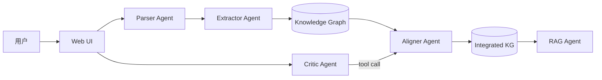

# Agent 架构说明

## 1. 架构总览



## 2. Agent 列表

| Agent | 职责 | 输入 | 输出 |
|---|---|---|---|
| Parser | 前端解析教材文件 | PDF/MD/TXT/DOCX | Textbook 对象（章节列表） |
| Extractor | 从章节抽取知识点和关系 | Chapter 文本 | KnowledgePoint[] + Relation[] |
| Aligner | 跨教材对齐整合 | 多本教材的 KP | 合并后的 KP + 决策列表 |
| RAG | 基于教材内容的问答 | 用户问题 | 带引用的回答 |
| Critic-Chat | 多轮对话修改整合决策 | 用户指令 | 更新后的决策 + 解释 |

## 3. 数据流

1. **上传** → Parser Agent 解析文件，生成 Textbook 对象
2. **解析** → 前端按格式切分章节，POST /api/textbooks 持久化
3. **抽取** → Extractor Agent 并发调用 LLM，每章生成知识点和关系
4. **对齐整合** → Aligner Agent embedding 相似度召回 + LLM 二次判定
5. **RAG 索引** → 分块 → batchEmbed → 内存向量存储
6. **问答/对话** → RAG Agent 检索 top-k → LLM 生成回答；Critic Agent 解析用户意图修改决策

## 4. 调用链路

| API | 调用 Agent | 输入 | 输出 |
|---|---|---|---|
| POST /api/textbooks | Parser | Textbook JSON | { ok, id } |
| POST /api/extract | Extractor | { textbookId } | { knowledgePoints, relations } |
| POST /api/align | Aligner | { textbookIds } | { decisions, mergedKnowledgePoints, mergedRelations, stats } |
| POST /api/rag/index | RAG | { textbookIds } | { ok, chunkCount } |
| POST /api/rag/query | RAG | { question } | { answer, citations } |
| POST /api/chat | Critic | { messages } | { message, updatedDecisions } |

## 5. 关键设计决策

1. **内存向量库**：5h 时限，无需引入 pgvector/Pinecone，用 /tmp/vectors.json 文件持久化
2. **余弦阈值 0.85**：实测在教材知识点场景下，0.85 能较好平衡召回率和精度
3. **先 embedding 召回再 LLM 二次判定**：embedding 快速筛选候选，LLM 做精细判定，降低调用成本
4. **前端解析 PDF**：绕开 Vercel 函数 10s 超时，大文件在前端解析后仅传输文本

## 6. Agent 间通信格式

### 6.1 教材对象（Parser → Extractor）

```json
{
  "id": "tb_001",
  "name": "生理学",
  "format": "pdf",
  "chapters": [
    {
      "id": "ch_001",
      "title": "细胞的基本功能",
      "index": 0,
      "text": "静息电位是指细胞在安静状态下...",
      "charCount": 3500
    }
  ]
}
```

### 6.2 抽取结果（Extractor → KG）

```json
{
  "knowledgePoints": [
    {
      "id": "kp_001",
      "name": "静息电位",
      "definition": "细胞在安静状态下膜两侧的电位差",
      "category": "概念",
      "textbookId": "tb_001",
      "chapterId": "ch_001",
      "frequency": 1,
      "sourceSpans": [{"chunkId": "c_001", "text": "静息电位是指..."}]
    }
  ],
  "relations": [
    {
      "id": "r_001",
      "source": "kp_001",
      "target": "kp_002",
      "type": "前置依赖",
      "description": "理解动作电位需要先掌握静息电位"
    }
  ]
}
```

### 6.3 整合决策（Aligner → UI/Chat）

```json
{
  "id": "dec_001",
  "groupKpIds": ["kp_001", "kp_015"],
  "decision": "merge",
  "reason": "两本教材对'静息电位'的定义基本一致",
  "confidence": 0.95,
  "mergedName": "静息电位"
}
```

### 6.4 RAG 检索结果（RAG → UI）

```json
{
  "answer": "根据教材内容，静息电位是指...",
  "citations": [
    {
      "textbookName": "生理学",
      "chapter": "细胞的基本功能",
      "page": 12,
      "snippet": "静息电位是指细胞在安静状态下..."
    }
  ]
}
```

## 7. 错误处理流程

### 7.1 错误分级与策略

| 层级 | 错误类型 | 处理策略 | 用户体验 |
|---|---|---|---|
| L1 | 前端解析失败（PDF/DOCX） | 捕获异常，标记 status='error'，显示具体错误 | 红色提示 + 重试按钮 |
| L2 | LLM API 超时/限流 | 指数退避重试 2 次，仍失败则 fallback | loading 态保持，失败后显示 fallback 数据 |
| L3 | LLM 返回非 JSON | 正则提取 markdown 代码块，再 try JSON.parse | 后台静默修复，用户无感知 |
| L4 | LLM 返回空知识点 | 基于文本分句自动生成基础知识点 | 用户看到基础图谱，不中断流程 |
| L5 | Embedding API 失败 | 按 64 条分批，单批失败重试 1 次 | 进度条暂停后恢复 |
| L6 | 对齐整合无候选 | sim < 0.85 时直接 keep 所有，提示用户 | 显示"未发现重复知识点" |

### 7.2 重试机制

```
LLM 调用：
  首次调用 → 等待 30s
    ├── 成功 → 返回结果
    ├── 超时/5xx → 等待 5s 重试
    │     ├── 成功 → 返回结果
    │     └── 失败 → fallback（空结果 / 自动生成）
    └── 4xx/模型不存在 → 直接报错，不重试
```

### 7.3 并发控制

- **知识点抽取**：手写信号量，上限 5 个章节同时调用 LLM
- **Embedding**：batchEmbed 内部 64 条/批，串行执行
- **对齐整合**：候选组串行调用 LLM 判定，避免并发过高

## 8. 持久化策略

| 数据 | 存储位置 | 格式 | 生命周期 |
|---|---|---|---|
| 教材元数据 | `/tmp/textbooks.json` | JSON 数组 | 服务器重启后保留（Vercel 冷启动会丢失） |
| 知识图谱 | `/tmp/kg-{textbookId}.json` | JSON | 同上 |
| 向量索引 | `/tmp/vectors.json` | JSON | 同上 |
| 整合结果 | `/tmp/aligned.json` | JSON | 同上 |
| 对话历史 | `localStorage` | JSON | 浏览器本地持久 |
| 整合决策 | `localStorage` + `/tmp/aligned.json` | JSON | 双写，刷新页面不丢失 |

> Vercel Serverless 的 `/tmp` 在单次请求内有效，冷启动后丢失。生产环境如需持久化，需替换为外部存储（如 Redis / 数据库）。

## 9. 性能与成本优化

| 优化点 | 策略 | 效果 |
|---|---|---|
| 前端解析 PDF | 大文件不上传后端，仅传文本 | 绕开 Vercel 10s 超时 |
| 分块截断 | 章节 > 6000 字截断 | 减少 LLM token 消耗 |
| Embedding 分批 | 64 条/批 | 避免 API 限流 |
| 并发上限 5 | 手写信号量 | 控制 API 调用速率 |
| 相似度预筛选 | 0.85 阈值过滤候选 | 减少 LLM 二次判定次数 |

## 10. 已知局限与改进

1. 内存向量库不支持并发
2. LLM 抽取偶尔抛出 JSON parse 失败，需自动 fallback
3. 引用必须来自 metadata
