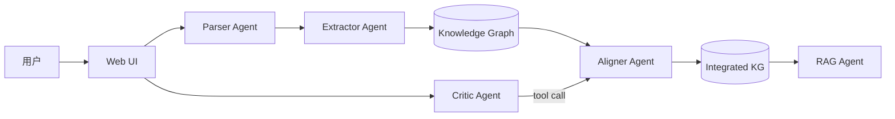

# Agent 架构说明

## 1. 架构总览

## 2. Agent 列表

| Agent | 职责 | 输入 | 输出 |
|---|---|---|---|
| Parser | 前端解析教材文件 | PDF/MD/TXT/DOCX | Textbook 对象（章节列表） |
| Extractor | 从章节抽取知识点和关系 | Chapter 文本 | KnowledgePoint[] + Relation[] |
| Aligner | 跨教材对齐整合 | 多本教材的 KP | 合并后的 KP + 决策列表 |
| RAG | 基于教材内容的问答 | 用户问题 | 带引用的回答 |
| Critic-Chat | 多轮对话修改整合决策 | 用户指令 | 更新后的决策 + 解释 |

## 3. 数据流

1. **上传** → Parser Agent 解析文件，生成 Textbook 对象
2. **解析** → 前端按格式切分章节，POST /api/textbooks 持久化
3. **抽取** → Extractor Agent 并发调用 LLM，每章生成知识点和关系
4. **对齐整合** → Aligner Agent embedding 相似度召回 + LLM 二次判定
5. **RAG 索引** → 分块 → batchEmbed → 内存向量存储
6. **问答/对话** → RAG Agent 检索 top-k → LLM 生成回答；Critic Agent 解析用户意图修改决策

## 4. 调用链路

| API | 调用 Agent | 输入 | 输出 |
|---|---|---|---|
| POST /api/textbooks | Parser | Textbook JSON | { ok, id } |
| POST /api/extract | Extractor | { textbookId } | { knowledgePoints, relations } |
| POST /api/align | Aligner | { textbookIds } | { decisions, mergedKnowledgePoints, mergedRelations, stats } |
| POST /api/rag/index | RAG | { textbookIds } | { ok, chunkCount } |
| POST /api/rag/query | RAG | { question } | { answer, citations } |
| POST /api/chat | Critic | { messages } | { message, updatedDecisions } |

## 5. 关键设计决策

1. **内存向量库**：5h 时限，无需引入 pgvector/Pinecone，用 /tmp/vectors.json 文件持久化
2. **余弦阈值 0.85**：实测在教材知识点场景下，0.85 能较好平衡召回率和精度
3. **先 embedding 召回再 LLM 二次判定**：embedding 快速筛选候选，LLM 做精细判定，降低调用成本
4. **前端解析 PDF**：绕开 Vercel 函数 10s 超时，大文件在前端解析后仅传输文本

## 6. 失败兜底

- LLM JSON 解析失败：尝试提取 markdown 代码块中的 JSON，fallback 为空结果
- 模型返回空知识点：基于文本分句生成基础知识点，确保 demo 流程不中断
- Embedding 限流：batchEmbed 内部按 64 条分批，避免一次性请求过多
- 空数据状态：UI 显示空状态提示，引导用户操作
